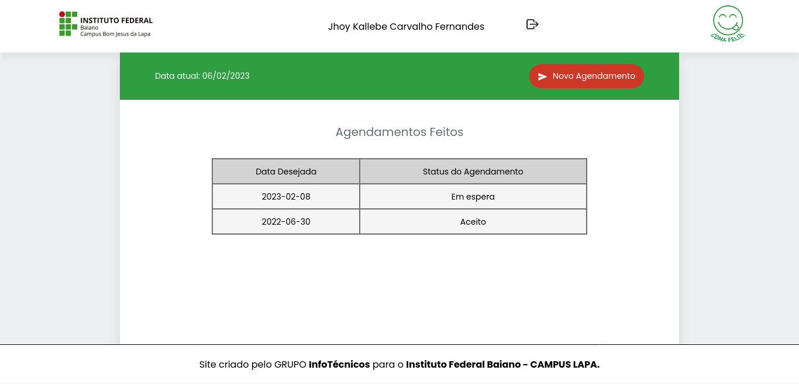
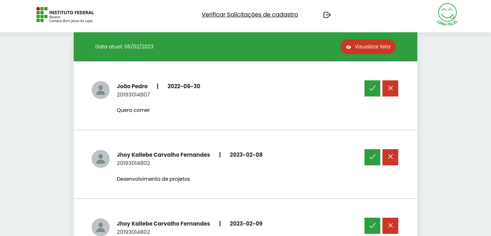

# Projeto Coma Feliz

Tela Principal do Usuário

Tela Principal do Adm

> Projeto desenvolvido como instrumento de avaliação para a equipe 03 na disciplina de programação WEB, cuja principal função é o gerenciamento dos pedidos de almoço dentro da instituição.
### Ajustes e melhorias

Projeto concluído na data 29/06/2022:

- [x] Wireframe
- [x] Front-end
- [x] Back-end

## 🤝 Colaboradores

<table>
  <tr>
    <td align="center">
      <a href="https://github.com/Jhoy-Kallebe">
         
        
          <b>Jhoy Kallebe</b>
        
      </a>
    </td>
    <td align="center">
      <a href="https://github.com/joaoboasorte">
         
        
          <b>João Pedro</b>
        
      </a>
    </td>
  </tr>
</table>

## 📝 Licença

MIT Licence

[⬆ Voltar ao topo](#projeto-coma-feliz) 
